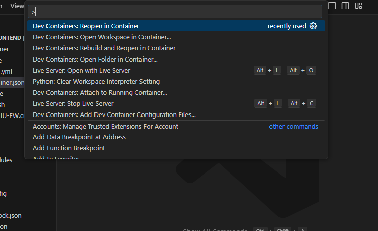

# プロジェクト基礎 食券販売Webサイト

## 依存ソフトウェア

- git
- Docker


## 環境構築

```bash
# GitHubからプログラムをダウンロード
$ git clone https://github.com/HIU-Bombers/project-web-frontend.git

# VisualStudioCodeを開く
$ code ./project-web-frontend
```

> [!WARNING]  
> DockerのインストールとVSCodeに"DevContainers"の拡張機能が追加されているのが前提です

<br>

1. `ctrl` + `shift` + `p` を同時に押す
2. 上部に出てきたパレットで、`Dev Containers: Reopen in container` を選択する




> [!TIP]  
> DevContainerとは、プログラムを開発するための作業環境を、簡単に作成して使える仕組みのことです。  
> 構築される作業環境には以下のようなものが含まれます。
> - OS
> - 開発をする上で必要なアプリケーション
> - VSCodeの拡張機能

## 起動

### 初回実行

```bash
# 動かすのに必要な外部のプログラムをインストールする
$ npm install 

# webpackを使って必要なライブラリをバンドルする
$ npm run build
```

### サーバー立ち上げ

```bash
# webpack serveでサーバーを立ち上げる
# デフォルトではlocalhost:3000で立ち上がる
$ npm run dev
```


## コードの書き方

### どこに書くの?

- `/views` ディレクトリ上にhtmlを生やしていく  
- `/views/hogehoge/index.html` のようにファイルがあった場合、`http://localhost/hogehoge` でページを閲覧できるようになる  


### コードを書く前に

以下のコマンドをうって、自分のブランチ (≒作業スペース) を作成してください

```bash
# (例) しながわ あさひ => a-shinagawa
# git checkout -b a-shinagawa
$ git checkout -b {自分の名前}
```

### コードを書いたら

gitを用いて、以下の手順で変更を記録していってください

```bash
# 変更したファイルを選択する
$ git add {変更したファイル名}

# 名前を付けて作業を記録する
# git commit -m "Homeページにログインボタンを追加"
$ git commit -m "{「hogeの実装」のような作業メッセージ}"

# 毎回する必要はないけど、ある程度変更履歴がまとまったらやる
# GitHubに変更履歴をアップロードする
$ git push origin HEAD
```
